# СУБД
## Понятие базы данных
**БД** - по именованная совокупность структурированных данных относящихся к предметной области. 

**Предметная область** - некоторая часть реально существующей системы, функционирующая как самостоятельная единица.

Полная предметная область может представлять собой, экономику страны или даже группы государств. На практике для информационных систем наибольшее значение имеет предметная область, масштабы отдельного предприятия или корпорации.

**СУБД** - комплекс программных и языковых средств, необходимых для создания и модификации БД, добавления, модификации, удаления, поиска и отбора информации, представления информации на экране и в печатном виде, разграничения прав доступа к информации, оптимизации информации и выполнение других операций с базой данных. 

**Приложения** - программы пользователей, которые работают с информацией из БД. 

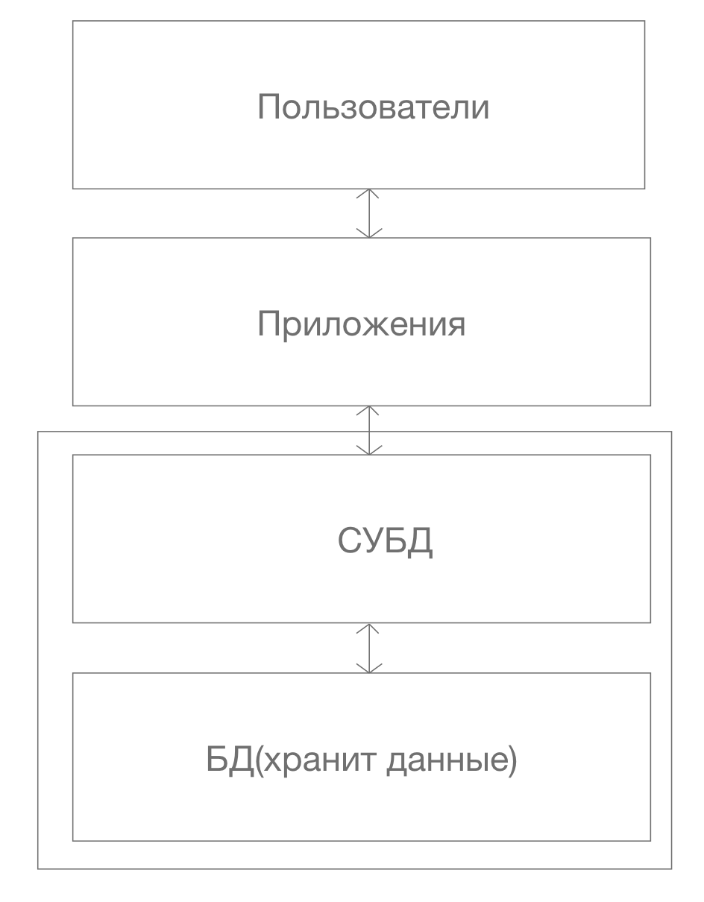

На самом нижнем уровне находятся данные, они физически хранятся в файлах на жестком диске. На верхнем уровне располагается приложение, у которых есть свое собственное представление физических данных. Каждое представление БД, предполагает определенную логическую структуру, построенную из лежащих в нее основе физических данных.

СУБД обеспечивает интерфейс между физической памятью данных и ее разнообразными логическими версиями.

## Классификация БД
1. По технологии обработки данных различают централизованные и распределенные БД:
**Централизованные БД** - хранят данные в памяти одной вычислительной системы (на одном сервере).
**Распределенные БД** - состоят их нескольких пересекающихся или даже дублирующих друг друга частей, которые расположены на различных серверах вычислительной сети. Работа с такой базой осуществляется с помощью СУ распределенной БД (СУРБД). Основная задача СУРБД состоит в обеспечении интеграции локальной БД располагающихся в некоторых узлах вычислительной сети. Цель - обеспечить пользователя работающего в любом узле сети, доступом к распределенной БД, как к единой БД.

Существуют **однородные** и **неоднородные** распределенные БД: к однородным относятся БД управляемые одной и той же СУБД, к неоднородным относятся БД управляемые различными СУБД. Сетевая интеграция неоднородных БД очень сложная проблема.
2. По способу доступа к данным: **локальные** и **сетевые**.
Взаимодействие пользователя с БД строится на модели клиент-сервер. Клиентская часть отвечает, за целевую обработку данных и за взаимодействие с пользователем. Серверная часть обеспечивает хранение данных, обрабатывает запросы и посылает результаты клиенту для специальной обработки. В общем случае эти части функционируют на отдельных компьютерах. Т.е. к серверу БД с помощью сети подключены компьютеры клиентов. Распределение на клиентскую и серверную части позволяет: одновременно использовать БД различным прикладным программам, централизовать функции управления, такие как защита информации, обеспечения целостности данных, управления совместным использованием ресурсов, обеспечить параллельную обработку распределенных БД, высвободить ресурсы рабочих станций и сети, повышать эффективность управления данными,   за счет использования специальных серверов БД.

## Назначения и основные функции СУБД
Архитектура СУБД имеет следующий вид:

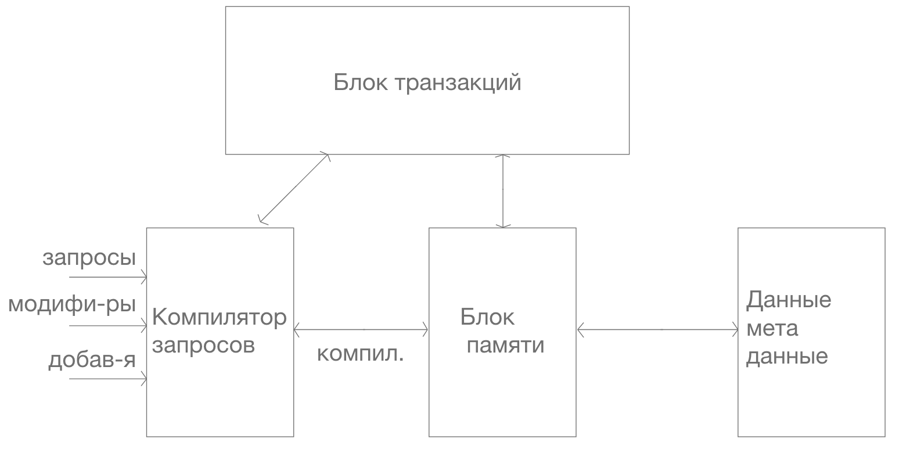

Компонент «Данные мета-данные» включает не только данные хранящиеся в БД, но и информацию о структуре данных (метаданные). 

Компонент «Блок памяти» получает требуемую информацию из места хранения данных и может изменять в нем информацию по требованию выше стоящей системы.

Компонент «Компилятор запросов» обрабатывает различные обращения к СУБД и запрашивает данные и метаданные из хранилища.  Он определяет наилучший способ выполнения операции и выдает соответствующие команды блоку памяти. Как правило компилятором запроса обрабатываются 3 типа обращения к СУБД: **запросы**, **модификации**(операции по изменению данных),  **модификации схемы БД**  (команды администраторов которые могут изменять схему БД либо создавать новую БД).

Компонент «Блок транзакций» отвечает за целостность системы, должен обеспечить одновременную обработку многих запросов гарантировать исключения наложения запросов друг на друга, и защиту данных в случае выхода системы из строя. Блок транзакций взаимодействует с компилятором для разрешения конфликтных ситуаций и учитывает на какие данные воздействуют текущие запросы. Блок транзакций может отложить выполнение некоторых запросов или восстановить очередность их выполнения. Блок транзакций также взаимодействует с блоком памяти так как схема защиты данных, обычно включает в себя хранения файла регистрации изменения данных.

Типичные СУБД позволяют выполнить несколько запросов в одной транзакции, также СУБД поддерживают режим автоматических транзакций.

СУБД поддерживает множество транзакций, правильное их выполнение обеспечивается **ACID** свойствами. 
1. (Atomicity Consistency Isolation D в рамках транзакции, представляются собой единое не делимое действие. Они либо полностью принимаются или полностью откатываются.
2. (Consistency) Согласованность - транзакции всегда приводят к непротиворечивому состоянию БД. После ее завершения БД должна находится либо в новом, либо в старом непротиворечивом состоянии. **Непротиворечивое состояние** - состояние БД без нарушения целостности данных.
3. (Isolation) Изолированность - транзакции выполняемые параллельно не должны влиять друг на друга. Транзакции могут использовать одни и тебе данные, но изменения проводимые в одной транзакции, не должны влиять на другую транзакцию. 
4. (Durability) Долговечность - если транзакция выполнена все изменения проводимые ей должны быть сохранены в БД. При откате все изменения из БД должны быть изъяты.

## Классификация СУБД
В настоящее время СУБД  получили очень широкое распространение в различных сферах деятельности человека. Они выполняют основную часть процедур связанных с накоплением и обработкой информации.

### По способу применения
1. Персональные СУБД  - используются для работы с личными БД , имеют маленький масштаб. (TinySQL)
2. Корпоративные СУБД - используются для работы с большими БД масштаба предприятия. (MS Access)

**Персональные СУБД:** 
* СУБД для которых работа с БД  возможна только после ручного запуска в работу. Эти системы не имеют возможности создания автономных программ, работающих с БД (MS Access, Paradox, dBase).
* СУБД имеющие средства для работы с БД и средства для разработки исполняемых в ОС пользовательских программ (FoxPro).
* Системы для разработки пользовательских программ для работы с БД (Clipper, Clarion)

**Корпоративные СУБД** - Oracle, MS SQL Server, MySQL, DB2, Informix, PostgresSQL.

**Требования к корпоративным СУБД**:
1. Интероберабельность - возможность использования БД в разных программных системах. 
2. Мобильность(переносимость) - возможность переноса СУБД на другие аппаратно-программные платформы.
3. Параллельная обработка 
4. Распределенная разработка
5. Активный сервер

### По количеству пользователей
Однопользовательские и Многопользовательские.

### По степени распределености
Локальные и Распределенные

### По способу доступа к данным
1. File-server-ные СУБД - в этих СУБД файлы данных располагаются централизованно на файл-сервере, а на данный момент такая технология считается устаревшей. Ее применяют: Access, Paradox, FoxPro, dBase.
2. Клиент-серверные СУБД - СУБД располагается на сервере вместе с БД, все клиентские запросы на обработку данных обрабатываются клиент-серверной СУБД централизованно (Oracle, MS SQL Server, MySQL, DB2, PostgresSQL).
3. Встраиваемые СУБД - поставляются как составная часть некоего программного продукта, не требуют процедуры отдельной установки. Данные СУБД предназначены для локального хранения данных своего приложения, и не рассчитаны на коллективное использование в сети (SQL Lite, Compact, Oracle EE).

### СУБД разделяют по модели представления данных

1. Иерархические
2. Сетевые
3. Реляционные
4. Объектно-ориентированные

## Модели представления данных в БД
Важнейшей характеристикой БД является использованная в ней модель данных. 

### Иерархические БД

В основе данной модели лежит иерархическая модель данных. В ней есть один главный объект и остальные подчиненные объекты, которые находятся на разных уровнях иерархии. Взаимосвязи объекта образуют иерархические дерево с одним корневым обьектом.

Иерархическая БД состоит из упорядоченного набoра нескольких экземпляров одного типа дерева. Автоматически поддерживается целостность ссылок, между предками и потомками. Основное правило - никакой потом не может существовать без своего родителя.

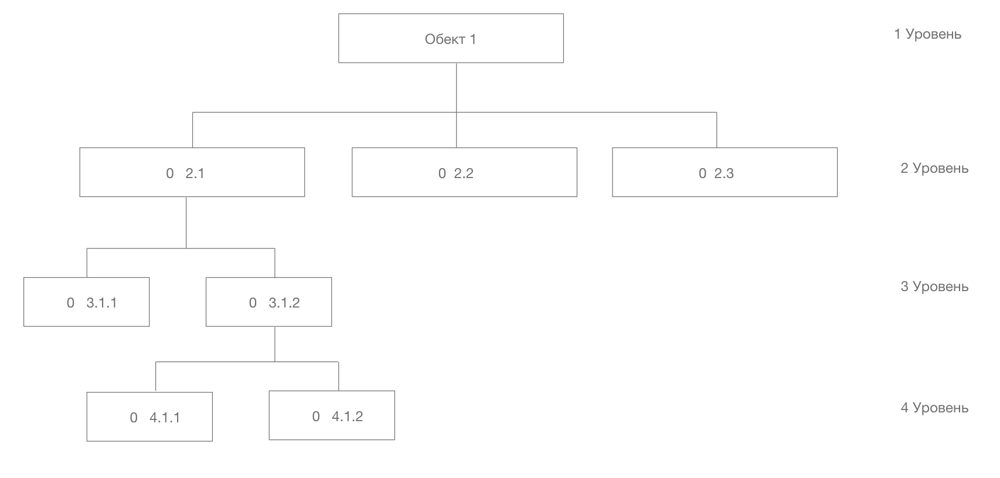
Схема иерархической структуры данных

Примером данной СУБД является IMS (Information Managment System), которая была выпущена в 1968 году.

### Сетевая модель БД

Сетевой подход к организации данных является расширением иерархического. В иерархических структурах объект потом имеет только одного предка, в сетевой модели потомок может иметь любое число предков. В сетевой модели данных любой объект может быть одновременно и главным и подчиненным, а также может участвовать в образовании любого количества взаимосвязи с другими обьектами. 

Сетевая БД состоит из набора записей и набора связей между этими записями. 

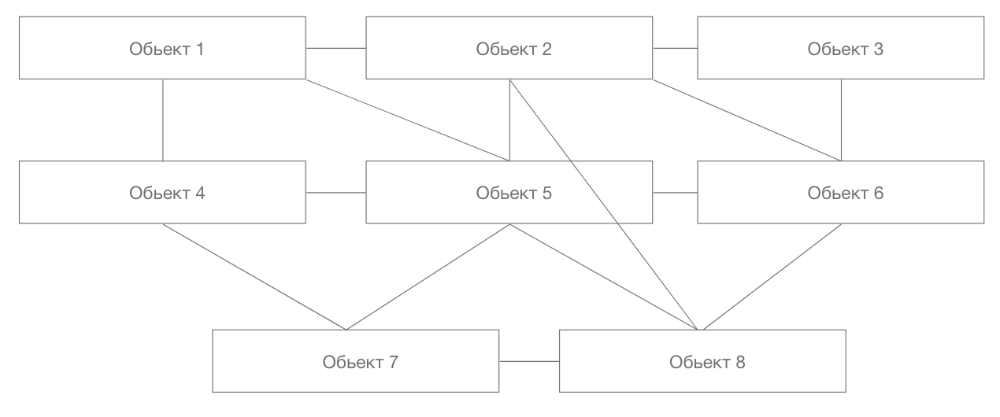

Например IDMS

### Реляционная модель данных
Наиболее широко распространена модель. Реляционные системы не сразу получили широкое распространение. Первые основные теоретические результаты в этой области были появились еще в 70-е года прошлого века. Тогда же появились первые прототипы реляционных СУБД. Однако долгое время считалось не возможным, добиться эффективной реализации таких систем, но происходило постепенное накопление методов и алгоритмов организации реляционных БД, которое привело к тому, что в середине 80-ых годов реляционные СУБД практически вытеснили с мирового рынка ранние СУБД. Реляционная модель данных основывается на математических принципах,  из теории множеств и логики предикатов. Эти принципы впервые были применены в области моделирования данных доктором Е.Ф. Коддом, в начале 70-ых годов, работавшем в то время в IBM. Статья E.Ф. Кодда «Реляционная модель данных для больших распределяемых банков данных» опубликованная в 1970 году, является родоначальницей современной теории реляционных БД.

### Пост-реляционная модель данных
В настоящее время известны так называемые пост реляционные СУБД, в основе которых лежит модель данных в виде многомерных таблиц. Представителем таких систем является система Cache от InterSystem Corp. 

### Обьектно-ориентированные БД
Этот тип похож на реляционную модель данных и является эффективным способом хранения сложных мультимедийных типов информации, к которым в том числе относятся конструкторская, технологическая документация. 

## Основные понятия реляционной модели данных
Реляционная модель данных в настоящее время доминирует на рынке. Основу этой модели составляет набор взаимосвязанных таблиц в которых хранятся данные. Представление данных в виде множественной совокупности таблиц позволило создать систему с упрощенным интерфейсным управлением. 

**Реляционная БД** - это основной тип современных БД который состоит, из отношений между которыми существуют связи по ключевым значениям. В теории реляционных БД  синоним таблиц является отношение (relation), в котором строка называется **кортежем**, а столбец **атрибутом**.  

Не каждая таблица может быть отношением. Чтобы таблица стала отношением необходимо чтобы таблица имела простую структуру, в таблице не должны дублироваться строки, любой столбец должен содержать данные только одного типа, все используемые типы данных должны быть простыми.

**Свойства отношений**:
1. Уникальность имени отношения
2. Уникальность кортежей
3. Каждая ячейка отношения содержит только атомарное значение (не делимое)
4. Не упорядоченность кортежей (в порядке добавления)
5. Не упорядоченность атрибутов
6. Уникальность имени атрибута в пределах отношения
7. Атомарность значений атрибутов

В концептуальной модели реляционных БД  аналогом таблицы является сущность с определенным набором свойств (атрибутов), способных принимать определенные значения. Набор допустимых значений называется **доменом**.

**Значение атрибута** - значение поля в записи
**Степень отношения** - количество столбцов в таблице
**Мощность отношения** - количество строк в таблице
**Ключевой элемент таблицы** - поле (простой ключ) или выражение их нескольких полей (составной ключ), по которому можно определить значение других полей для одной или нескольких записей таблицы.

На практике для использования ключей создаются индексы

**Индекс** - служебная информация содержащая упорядоченные значения о ключевых значениях.

**Первичный ключ (Primary Key)** - набор атрибутов однозначно идентифицирующий кортеж отношений. Первичный ключ всегда уникальный. В концептуальной реляционной модели первичный ключ это минимальный набор атрибутов сущностей, однозначно идентифицирующий экземпляр сущности.

**Внешний ключ (Foreign key)** - ключевой элемент подчиненного (внешнего или дочернего)  отношения значение которого совпадает со значением первичного ключа, главного или родительского отношения.

- - - -

**Ссылочная целостность данных** - набор правил обеспечивается соответствием ключевых значений в связанных отношениях.

**Хранимые процедуры** -  программные модули хранящиеся в БД предназначенные для выполнения определенных операций с информацией в БД.

**Репликация БД** - это создание копий БД, которая может обеспечивайся обновленными данными в результате выполнения процесса синхронизации.

**НЮЛЛ** - значение поле таблицы показывающая, что информация в данной ячейке соответствует разрешение на возможность редактировать значения НЮЛЛ задавать для сохранения полей таблицы.

**Связь** -  это функциональная зависимость между объектами. В реляционных БД между отношениями устанавливаются связи по ключам, один из которых в xxx отношении - первичный ключ, а второй внешний ключ - в xxx отношении первичным не является, и обрусеет связь **один ко многим**.

В случае если внешний ключ является первичным, то связь между отношениями имеет тип **один к одному**. Информация о связях сохраняется в БД.

**Информационная система** - это программно-xxx комплекс предназначенный для хранения и обработки информации какой либо предметной области.

**БД** -  это важнейший компонент любой информационной системы.

Хорошо структурированная информация в БД позволяет не только хорошо эксплуатировать систему и выполнять выполнять ее текущее обслуживание, но и модернизировать или  xxx ее при модернизации предприятия или  xxx информационных потоков, законодательства и форм отчетности.

### 12 Правил реляционной модели

1. Информационное правило - вся информация в реляционных БД включая имени таблицы и столбцов данных определяется строго как значения в таблицах.
2. Гарантированный доступ - это означает, что любое значение в реляционных БД должно быть гарантированно доступно для использования, через комбинация имени таблицы, значения первичного ключа и имени столбца.
3.  Поддержка пустых значений - СУБД должна уметь работать с пустыми значениями, не зависимо от любых доменов и в отличии от значений по по умолчанию.
4. Онлайновый реляционный каталог - описание БД и ее содержание должны быть представляемы на логическом уровне как таблица к контрой можно применять запросы, используя язык БД.
5. Исчерпывающий язык управления данными. По крайней мере один из поддерживаемых языков  должен иметь четко определенный синтаксис и быть все обхватывающим.  Он должен поддерживать синтаксис, структуры данных, манипулировать данными, правила целостности , авторизацию и транзакции.
6. Правило обновления представлений (view) -  все представления теоретически должны быть обновлённый и могут быть обновлены через систему.
7. Xxx обновления xxx СУБД должно поддерживать запрос на отбор данных, но и вставку, обновление и удаление.
8. Физическая независимость данных, структура хранения данных и методы доступа к данным логически не влияют на программы и приложения которые с ними работают.
9. Логическая независимость данных. Изменение структур таблиц логически не должно влиять на программы и приложения ( в пределах разумного)
10. Независимость целостности. Язык БД должен быть способен определять правило целостности. Они должны сохраняюсь в xxx каталоге и не должно существовать способа их обойти.
11. Не зависимость распределения. Ни программные приложения логически не должно влиять первый раз или повторно используются данные.
12. Не подрывность. Т.е. нет возможности обойти правила целостности определенные через язык БД использованием языков прикладного уровня.

### Структурная часть БД

Структура данных предполагает представление предметной области рассматриваемой xxx в виде таблицы взаимосвязанных отношений. При создании информационных систем совокупность отношений, позволяет хранить данные из предметной области и моделировать связи между ними. В каждой связи одного отношения может выступать базовое (основное), а другое отношение в роли подчиненного, производного т.е. Один картеж основного отношения, может быть связан с несколькими значениями подчиненного.

Для подчиненых этой связи оба отношения должны содержать набор атрибутов  по которым они связаны. В основном отношении это первичный ключ, использующий однозначно определяемый картеж е основного отношения, В подчиненном отношении для моделирования связи должен присутствовать набор атрибутов, соответствующий первичному ключу основного отношения.

Этот набор атрибутов является внешним ключом и он отпределает множество картежэй отношения, которые связаны с одним кортежем основного отношения.

Множество связанных между собой отношения образуют схему БД.

Основные элементы реляционной модели на примерах студента.

Таблица (первичный)струдента с №зачетки, имя, фамилия, отчество, дата рождения

Таблица (первичный)Дата, Факультат, Курс, Группа, Специальность

Таблица экзаменов (внешний) №зачетки, (внешинй) Код предмета, Дата сдачи, Оценка

Не понятная шняга, поэтому забьем фиг.

- - - -

## Реляционная целостность данных

### Реляционная целостность данных рассматривается в двух аспектах:

1. Ключи отношений;
2. Реляционное ограничение целостности.
Первичным ключом называется атрибут отношения однозначно идентифицирующий каждый из его кортежей. ПК может быть простым (состоит из одного атрибута) или составным (сложным, т.е. состоять из нескольких атрибутов. Каждое отношение имеет комбинацию атрибутов, которое может служить ключом. Таким образом её состояние гарантируют то, что отношение это множество, которое не содержит одинаковых кортежей. Иногда отношение имеет несколько комбинаций атрибутов каждый из которых однозначно определяет все кортежи отношений. Такие комбинации атрибутов называются **возможные** или **альтернативные ключи**. Каждый из них можно выбрать в качестве первичного.

**Ключи необходимы для:** 
1. Исключение дублирования данных в ключевых атрибутах;
2. Упорядочивание кортежей;
3. Ускорение работы с кортежами отношений;
4. Организация связывания таблиц.

Если в отношении R1 имеется не  ключевой атрибут A значение которого совпадет со значением ключевого атрибута B другого отношения R2, то атрибут A отношения R1 является внешним ключом. С помощью внешних ключей устанавливаются связи между отношениями. Реляционная модель накладывает на внешние ключи ограничение для обеспечения целостности данных — это ограничение ссылочной целостности, т.е. каждому значению внешнего ключа должны соответствовать строки связываемых отношениях.

Для баз данных задаются 2 правила целостности которые называются реляционными ограничениями целостности (ограничение для всех допустимых состояний базы данных): 

1. Правило целостности сущностей (целостность отношений) — в основном отношении ни один атрибут первичного ключа не может содержать отсутствующих значений, то есть NULL;
2. Правило ссылочной целостности — значение внешнего ключа отношения должно либо соответствовать значению первичного ключа основного ключа отношения либо задаваться значением NULL.

### Проблемы ссылочной целостности

Существуют 4 типа изменений баз данных которые могут нарушить ссылочную целостность отношений:

1. Добавление новой строки потомка — когда происходит добавление новой строки в таблицу потомок значение её внешнего ключа должно быть равно одному из значений первичного ключа таблицы предок. Если это правило не соблюдать это приведёт к появлению строки сироты и разрушит целостность данных. Добавление строки в таблицу предка ошибок не вызовет;
2. Обновление внешнего ключа в строке потомке — та же проблема, что в и первой ситуации но выраженная в иной форме. Если внешний ключ в таблице потомке обновляется, то его новое значение должно быть равно одному из значений первичного ключа таблицы предка;
3. Удаление строки предка — если из таблицы предка удалит строку, то строки потомок станут сиротами (удаление строки потомка проблем не вызовет);
4. Обновление первичного ключа в таблице предке — если происходит изменение первичного ключа в таблице предке, то все потомки этой строки становятся сиротами.

Для соблюдения условий ссылочной целостности в базе данных предусмотрены следующие механизмы:

1. RESTRICT	 - запрещает удаление(изменение) строки таблицы предка если строка имеет потомка;
2. CASCADE — определяет что при удалении(изменении) строки в таблице предка все строки потомки автоматически удаляются (изменяются);
3. SET NULL — определяет что при удалении (изменении) строки предка внешним ключм во всех её строках потомках автоматически присваивается значение NULL;
4. SET DEFAULT - 	определяет что при удалении (изменении) строки предка внешним ключам во всех её строках потомках автоматически присваивается определенное значение по умолчанию установленное для данного столбца.

### Индексирование

Индекс представляет собой средство ускорения поиска записей в таблице а так же других операций использующих поиск например извлечение данных, модификация данных, сортировка данных, удаление данных и тому подобное. Таблицу для которой используется индекс называют индексируемой. Индекс содержит отсортированный по колонке или нескольким колонкам информацию и указывает на строки в которых хранятся конкретные значения колонки.

Во многих ситсемах индексы хранятся в отдельных индексных файлах. 

**Индексный файл** — хранимый файл особого типа в котором каждая запись состоит из двух значений: данные и указатель RID. Ключевые поля в большинстве СУБД индексируются автоматически, такие файлы называются файлы первичных индексов. Индексы создаваемые не для ключеввых полей называются вторичными или пользовательскими индексами. Введение данных индексов не изменяет физического расположения записей таблицы, но влияет на последовательность просмотра записей. Некоторые СУБД поддерживают класторизованные и хэшированные индексы.

**Класстеризованный индекс** — это специальная техника индексирования при которой данные таблицы располагаются в индексированном порядке. Для каждой таблицы может создаваться только один класторизоавнный индекс.

**Хэширование** — это альтернативный способ хранения данных в заранее заданном порядке с целью ускорения поиска (прямого доступа). При хэшировании указатель вычисляется с помощью некоторой хэш-функции и называется хэш-кодом. Хэш-код имеет постоянную длину.

### Пректирование реляционных баз данных

Элементы разаботки реляционной базы данных

Для разработки реляционных БД чаще всего используется модель описания данных сущность-связь (ER-молель или ER-диаграмма) основные элементы модели:
1. Множество сущностей;
2. Атрибуты;
3. Связи.

**Сущность** — это абстрактый объект определенного вида. Набор однородных сущностей образует множество сущностей. Множество сущностей соответствует набор атрибутов являющихся свойствами отдельных его представителей.

**Связи** — это отношение между двумя или большим числом множеств сущностей.

### Теория нормализации

**Нормализация данных** — это разложение отношений на большее количество более простых таблиц.

Цели нормализации: 
1. Основной целью теории нормальных форм первоначально была экономия места на диске;
2. Данные должны быть устроены так чтобы при их редактировании или удалении необходимо было исправлять в одном месте базы данных;
3. Группировка данных по содержанию, то есть каждаая таблица соответствует определенной тематике;
4. Принцип модульности — унифицированных независимых блоков.
Первая нормальная форма: Отношение R Находится в первой нормальной форме тогда и только тогда, когда значения всех атрибутов атамарны.

Основой нормализации является процесс разбиения — декомпозиция. Причём для нормализации важен процесс декомпозиции без потерь данных. Процесс декомпозиции без потерь возможен если из полученных отношений можно полностью восстановить исходное отношение. По своей сути декомпозиция представляет собой проекцию, а обратное преобразование операцию соединения.
Пимерчик первой нормальной формы (там таблица Персональное рассписание)

У рассматриваемой таблицы легко выявить проблемы:
1. Добавление информации — НЕЛЬЗЯ сделать запись о том, что студент учится на какой то специальности не добавив информацию о хотябы одном занятии;
2. Удаление — обратная ситуация, если мы удалим то придётся удалять всё;
3. Изменение — при изменении группы у студента надо исправить не одно значение, а не сколько значений во всех записях соответствующих его занятию.

**Вторая нормальная форма**

Отношения находятся во второй нормальной форме тогда и только тогда, когда оно находится в первой нормальной форме и каждый не ключевой атрибут зависит от первичного ключа. Атррибут называется не ключевым если он не входит в состав ни одного возможного ключа, иначе он называется ключевым.

> Замечение: Определение второй нормальной формы было дано только для отношений с одним возможным ключом — если для каждой функциональной зависимости вида ключ не ключевой атрибут слева нельзя опустить ни один атрибут без потери части смысла то отношения находятся во второй нормальной форме.  

Определение отношений с несколькими ключами находится во второй нормальной форме тогда и только тогда, когда отношения находятся в первой нормальной форме и каждый не ключевой атрибут зависит от любого возможного ключа.

Проблемы:
1. Добавление — нельзя добавить информацию что студенты группы Х учатся а специальности 5102 не добавив ни одной записи о фамилиях студентов этой группы;
2. Удаление — при удалении всех студентов группы теряется информация о том, какую специльность изучала данная группа;
3. Изменение — при изменении номера специальности надо производить изменения не одной записи, а всех записей соответствующих стедентам данной специальноси.

Причина этих проблем заключается в наличии транзитивных зависимостей не ключевых атрибутов от ключевых

- - - -

 **Третья нормальная форма**

Отношения находятся в 3-й нормальной форме тогда и только тогда, когда она находится во второй нормальной форме и отсутствует транзитивные зависимости не ключевых атрибутов от ключевых.

Транзитивной зависимостью от ключевых будем считать следующее:
A->B, B->C. При этом A - набор ключевых атрибутов (ключ), B and C - множество не ключевых атрибутов. Из этого можно сказать что необходимо убедиться лишь в отсутствии взаимозависимостей между не ключевыми атрибутами.

**Нормальная форма Бойса-Кодда**

Определение третьей нормальной формы в основном применимо для случая с одним потенциальным ключом.  Когда отношение содержит два или более потенциальных ключа - это нормальная форма Бойса-Когда (НФБК).

Для этой нормальной формы характерны 3 условия:
1. Отношение имеет два или более потенциальных ключа
2. Ключи составные
3. Два или более потенциальных ключа перекрываются

Если хотя бы одно из этих условий не выполняется, то НФБК совпадает с третьей нормальной формой.

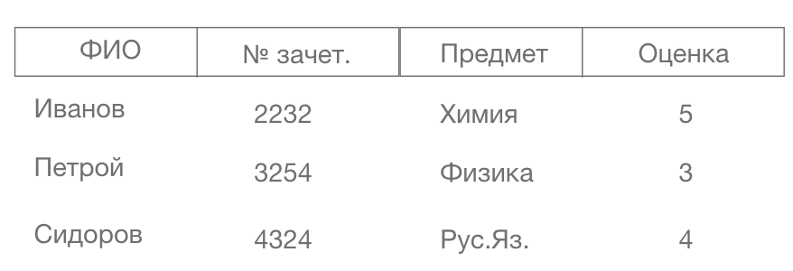

Если предположить что ФИО и номера зачеток не повторяются, то у этого отношения можно выделить два потенциальных ключа K1 - ФИО и предмет, K2 - второй оценка и номер зачетки.

В этом случае множество функциональных зависимостей будут выглядеть следующим образом: К1 * К2 = Оценка, К2 * К1 = Оценка, ФИО * Номер зач.

## Механизмы поиска в БД

### Основные виды индексов 
1. Простые индексы - для упорядоченных файлов
2. Вторичные индексы - для не упорядоченных файлов
3. Деревья (B-дерево, B+-дерево) 
4. Хеш таблицы

**Индексы для последовательных файлов**

1. Плотный индекс (размер файла индекса значительно меньше) - есть возможность бинарного поиска  и вероятность загрузки индекса в память.
2. Разреженный индекс (не уплотненный файл, скорость доступа к индексу выше, не надо разжимать)
3. Многоуровневый индекс  (не просто индекс, а множество уровней)

**Индексы для файлов с дубликатами ключей**
1. Плотный 
2. Плотный с дублированием
3. Разреженный с наименьшими значениями
4. Разреженный с наименьшими новыми значениями

Индексы поддерживают две операции: удаление, и вставка.

## B - деревья
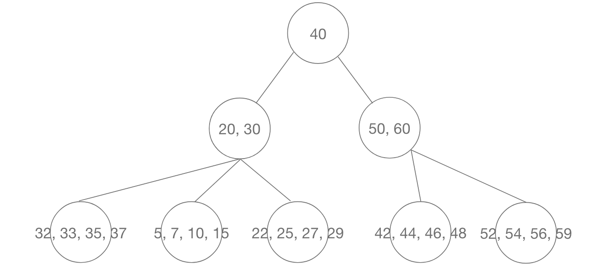

### Поиск по дереву*

1. Если в считанной странице обнаруживается пара ключей Кi и Кi+1, при Ki < K< Ki+1, то поиск ведется на странице Pi.
2. Если обнаруживается что К>Кмax, то поиск продолжается на странице Pmax.
3. Если K < K1, то поиск продолжается на странице P1.

### Добавление элемента в В-дерево

Предположим, что нам нужно добавить число 23 в наше дерево.

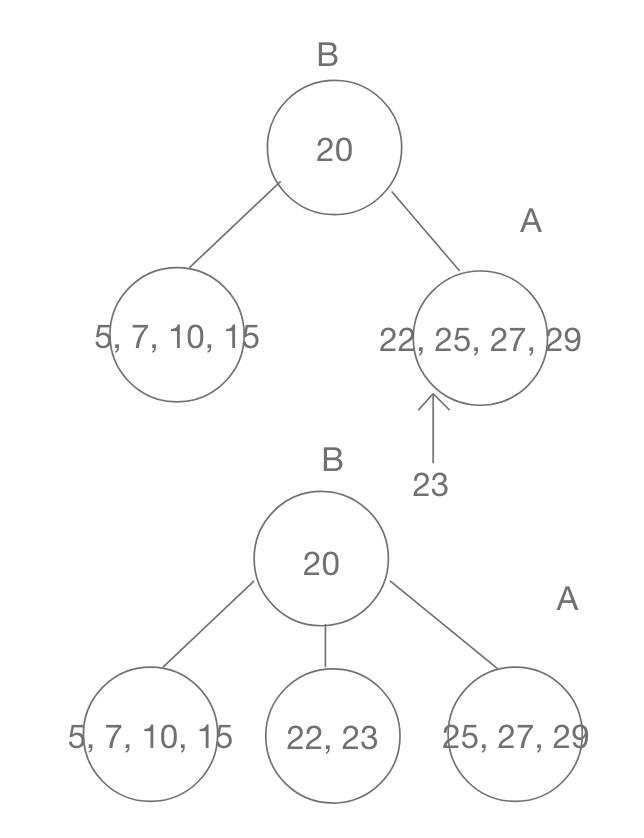

Вставка с расщеплением страницы А.

### Исключение из В-дерева

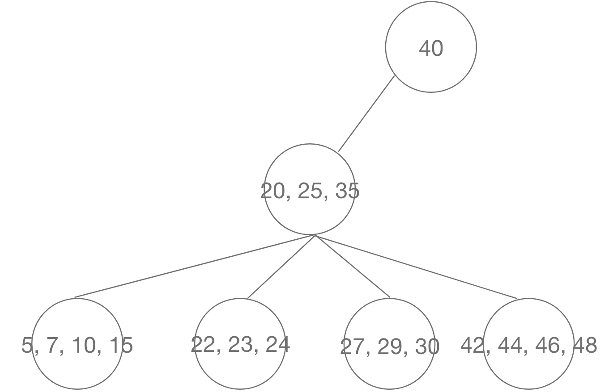

Предположим нам нужно удалить значение 25
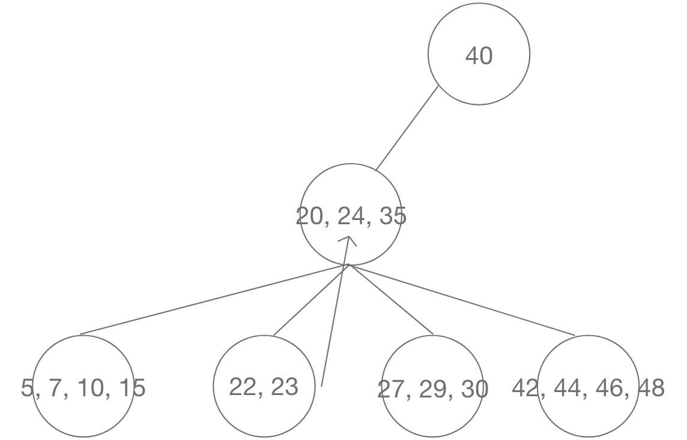

Максимальное значение из предыдущего перейдет на уровень выше

### Исключения с переливанием ключей

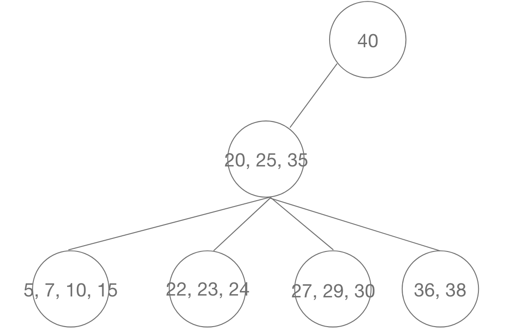

Предположим нам надо удалить 38

Происходит переливание ключей, задается новая граница на уровне выше,

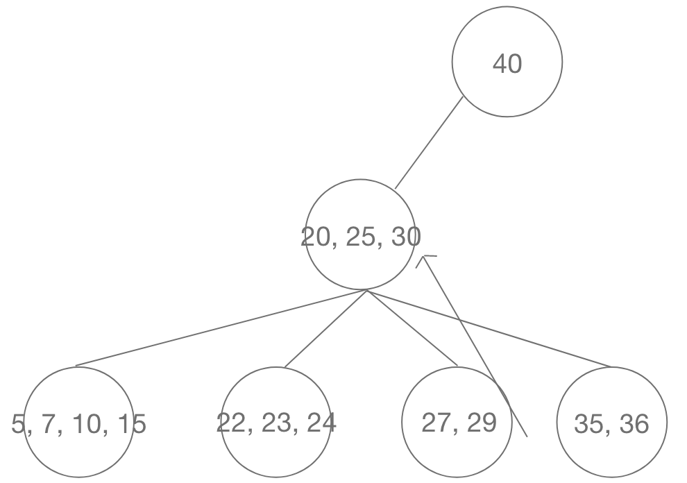


### Исключение со слиянием страниц

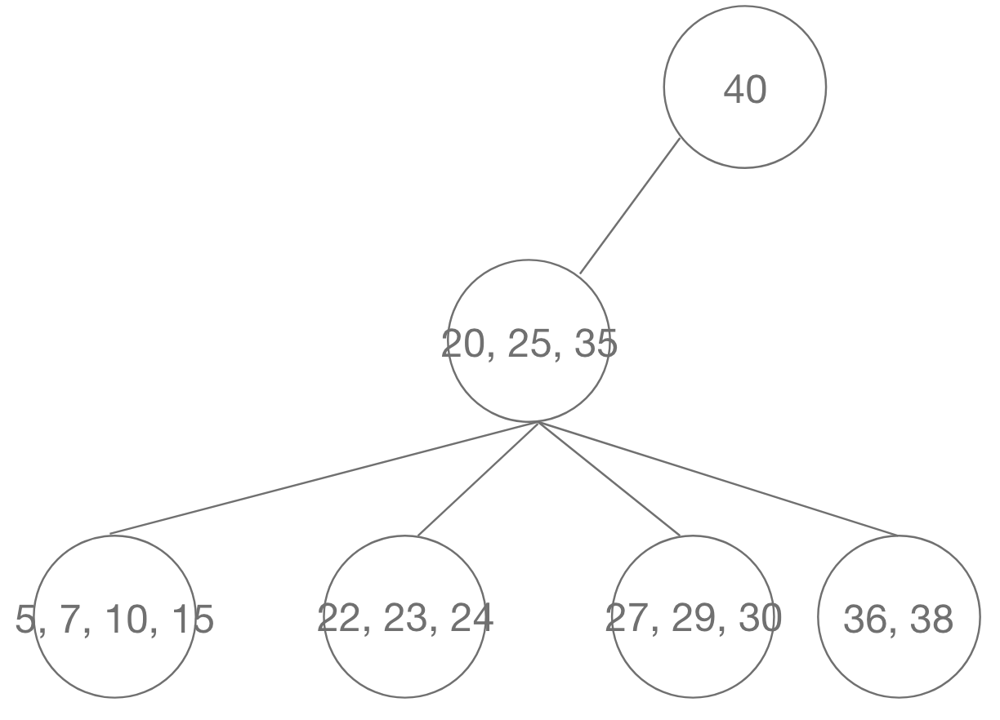

Предположим нам нужно удалить значение 29

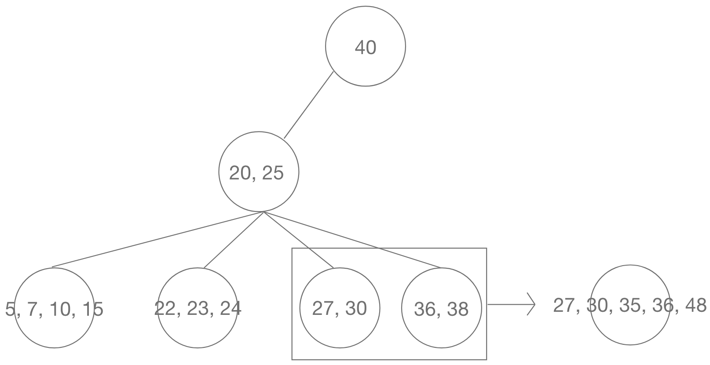

## В+ деревья

Отличия от В-деревьев:

1. Не листовые вершины содержат только ключи и ссылки на дочерние страницы.
2. Листовые вершины содержат множество ключей отношения, сами указатели на записи + указатель на следующий по порядку лист.
3. Ключи в листовых вершинах отсортированы по возрастанию

## R-дерево
Многомерный аналог В-дерева, каждая его промежуточная вершина соответствует некоторой области данных и содержит о себе информацию о вложенных в нее под областях т.е. дочерних вершинах. Листья R-дерева- таблицы точек.

# Архитектура БД с сетевым доступом
При размещении БД на персональном компьютере, который не находится в сети БД всегда используется в монопольном режиме. Даже если ее используют несколько пользователей, они могу работать только последовательно. Поэтому вопрос о поддержании корректной модификации БД здесь не стоит. 

Однако иногда требуется учитывать последовательность изменения данных при обработке.

Например: при запуске программы балансового бухгалтерского отчета, все финансовые операции (бухгалтерские проводки) должны быть завершены заранее до запуска отчетов.

 БД отражает информационную модель реальной предметной области она растет по обьему, и все больше увеличивается количество задач, решаемых с ее использованием. В соответсвии с этим увеличивается количество приложений работающих с единой БД.

Компьютеры объединяются в локальные сети и необходимость распределения приложений работающих с единой БД по сети является очень актуальным.

Когда вы строите БД даже для небольшой фирмы у вас появляется ряд пользователей которые имеют свои бизнес функции, они даже территориально могут находится в разных помещениях. Но все они должны работать с единой информационной моделью организаций т.е. с единой БД. Параллельный доступ к одной базе данных нескольких пользователей, соответсвует режиму распределенного доступа к централизованной БД.

Если же БД распределена по нескольким компьютерам расположенным в сети и к ней возможен параллельный доступ нескольких пользователей, то мы имеем дело с доступом к распределенной БД.

**Режимы использования БД можно представить в следующем виде:**

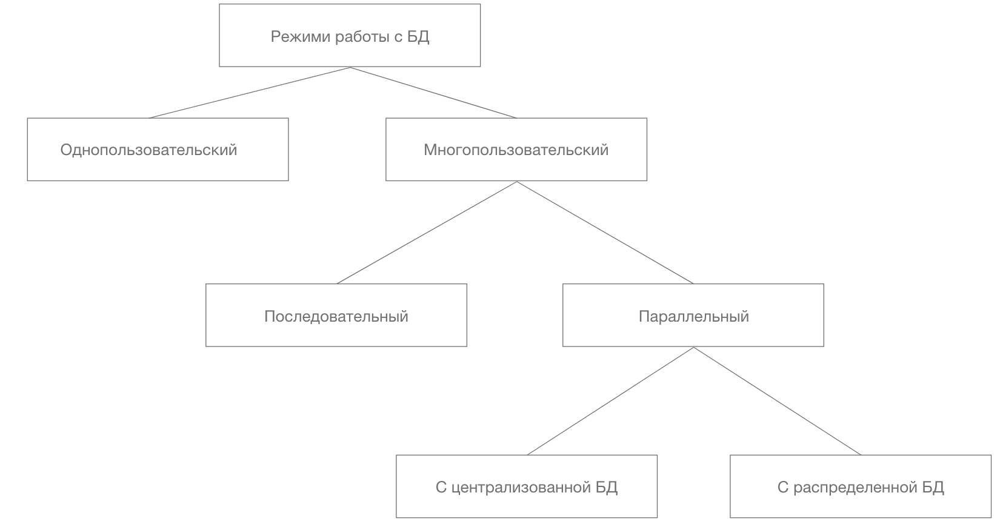

Термины: 

**Пользователь базы данных** - программа или человек обращающийся к БД. 

**Запрос** - процесс обращения пользователя к ДБ, с целью ввода, получения или изменения информации.

**Транзакция** - последовательность операций модификации БД, переводящая БД из одного не противоречивого состояния в другое не противоречивое состояние.

**Транзакция** - набор команд которые выполняются как единое целое, если одна из команд не выполняется то состояние откатывается.

**Логическая структура БД (ER-диаграмма)** - определение БД на физически не зависимом уровне. Ближе всего этому термину соответсвует концептуальная модель БД.

**Топология БД (структура распределенной БД)**  -  схема распределения физической БД по сети.

**Удаленный запрос** - запрос, который выполняется с использованием сети передачи данных.

**Удаленная транзакция** - транзакция, выполняемая на удаленной БД.

**Удаленная БД** - БД, находящаяся на удаленном узле сети передачи данных (за пределами локальной сети).

**Поддержка распределенной транзакции** - допускает обработку транзакции состоящей из нескольких SQL запросов, которые выполняются на нескольких узлах сети (удаленных или локальных), но каждый запрос в этом случае обрабатывается только на одном узле, т.е. запросы не являются распределенными. При обработке одной распределенной транзакции разные запросы в нутри нее могут обрабатываются на разных узнал сети.

**Распределенный запрос** - запрос при обработке, которого используются данные из БД расположенные в разных узлах сети.

**Down sizing** - переход от отдельных mainframe систем к открытым распределенным системам объединяющим компьютеры среднего класса.

**UpSizing** - переход от средних компьютеров к mainframe системам.

# Модель файл-сервер в технологии БД
В архитектуре файл сервер, средства организации БД, располагаются на машине клиента, а БД представляющая собой набор специализированных файлов, на машине сервере. В этом случае серверная компонента представлена даже не средствами СУБД,  а сетевыми составляющими ОС, обеспечивающими удаленный распределенный доступ к файлам.

Запрос к БД сформулированный на языке манипулирования данными преобразуется СУБД в последовательность команд ввода-вывода. Которые обрабатываются ОС машины сервера.

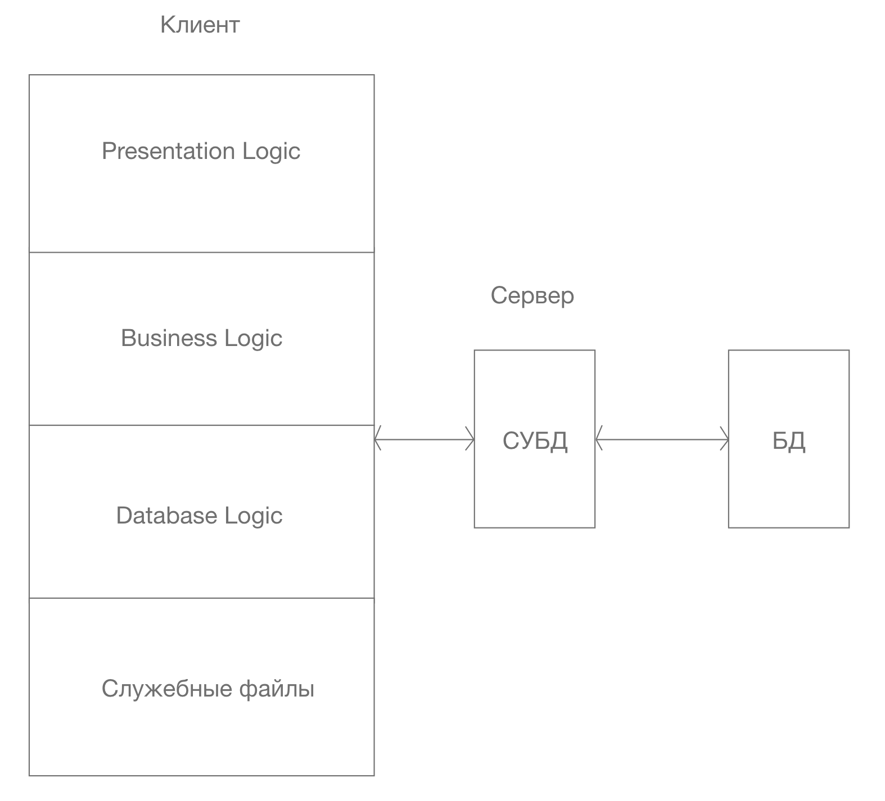


Функции работы с БД можно разделить на 5 групп:

1. Функции ввода и отображения данных Presentation-Logic
2. Прикладные функции, определяющие основные алгоритмы решения задач приложений Business Logic
3. Функция обработки данных внутри приложения Database Logic
4. Функции управления информационными ресурсами Database Manager System (Внутри СУБД)
5. Служебные функции, играющие роль связок между функциями первых 4 групп.


Презинтационная логика как чата приложения, определяется тем что пользователь видит на своем экране когда работает приложение. Сюда относятся все интерфейсные экранные формы, которые пользователь видит и заполняет в ходе работы приложения. К этой же части относится все то, что выводится пользователю на экран как результаты решения некоторых промежуточных задач. Поэтому основными задачами презентационной логики являются:

1. Формирование экранных изображений
2. Чтение и запись в экранные формы информации
3. Управление экраном
4. Обработка движения мыши и нажатия клавиш клавиатуры

В ОС сисмейства Windows презентационная логика реализованная посредством модели GUI - графического пользовательского интерфейса.

Бизнес логика или логика приложения (Business Logic) - часть кода приложения которая определяет алгоритмы решения конкретных задач приложения.Обычно этот код пишется на языках программирования типо C++, C#, Basic, Pascal, PHP и тд.

Логика обработки данных (Database Logic),  часть кода приложения, которая связанна с обработкой данных внутри приложения. Данными управляет СУБД , для обеспечения доступа к данным используется язык запросов SQL.

Операторы языка SQL встраиваются в языки высокого уровня, которые используются для написания кода приложения. Процесс управления данными обеспечивает СУБД, которая также следит за хранением данных. В идеале функции СУБД должны быть скрыты от бизнес логики.

**Недостатки архитектуры file-server:**

1. Высокая загрузка сети и машин клиентов тк обмен идет на уровне единиц информации файловой системы, физических записей, блоков и файлов.
2. Низкий уровень защиты данных тк доступ к файлам БД, управляется общими средствами ОС сервера.
3. Бизнес правила функциональной обработки сосредоточенные в клиентской части, могут быть противоречивыми.

# Двух уравнивая архитектура клиент-сервер
Двухуровневая модель практически является результатом распределения пяти указанных функций между двумя процессами, которые выполняются на двух платформах, на клиенте и на сервере. В чистом виде такая модель не существует. Рассмотрим характерные условия вариантов двухуровневой модели.

## Архитектура - выделенный сервер БД
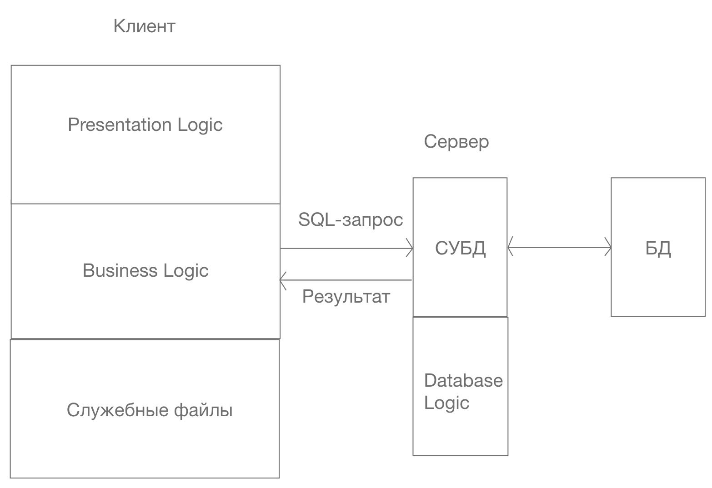

В архитектуре - выделенный сервер БД, средства управления БД и сама БД размещены на машине сервере.

В такой модели БД хранит данные на сервере, на нем находится ядро СУБД, на клиенте располагается презентационная логика и бизнес логика приложения.

Клиент обращается к серверу с запросами на языке SQL, поэтому сервер БД часто называют SQL сервером. На нем располагается одна из реляционных СУБД (Oracle, Postgres, Mysql). Сервер БД осуществляет поиск записей и анализирует их. Записи удовлетворяющие условиям накапливаются на сервере и после завершения обработки запроса передаются пользователю. Взаимодействие клиентского приложения с SQL сервером осуществляется через ODBC драйвер (Open Data Base Connectivity). ODBC стал стандартом доступа к разнородным БД.

Достоинства архитектуры - выделенный сервер БД:
1. Снижение нагрузки на машины серверов и клиентов
2. Снижение сетевого тарифа и повышение эффективности обработки за счет оптимизации и буферизации ввода-вывода.
3. Защита данных средствами СУДБ, позволяющая блокировать не разрешенные пользователю действия.
4. Сервер реализуется управление транзакциями и может блокировать попытки одновременного изменения одних и тех же записей

Недостатки архитектуры - выделенный сервер БД:
1. Бизнес логика функциональной обработки и представления данных могут быть одинаковыми для нескольких клиентских приложений, что увеличивает потребность в ресурсах (повторение кода программ и запросов)

## Архитектура активный сервер БД
Чтобы избавиться от недостатков модели удаленного доступа должны быть соблюдены следующие условия:
1. Необходимо чтобы БД в каждый момент отражала текущее состояние предметной области, которая определяется не только собственными данными, но и связями между объектами данных. То есть данные, которые хранятся в БД, в каждый момент времени должны быть не противоречивыми.
2. БД должна отражать некоторые правила предметной области и законы по которым она функционирует (Бизнес правила)
3. Необходим постоянный контроль за состоянием БД, отслеживание всех изменений и адыкватная реакция на них.
4. Необходимо чтобы возникновение некоторой ситуации в БД ,четко и оперативно влияло на ход выполнения прикладной задачи.
5. Одной из важнейших проблем СУДБ является контроль типов данных. 
 
В настоящее время СУБД контролируют только синтаксические стандартно допустимые типы данных. То есть определенные в DDL (Data Definition Language). Однако в реальных предметных областях у нас есть данные которые несут в себе семантическую составляющую. 

Данную модель поддерживают большинством современных СУБД(Oracle, MySQL, MS Sql), основу данной модели составляет механизм хранимых процедур, как средства программирования SQL сервера, механизм триггеров, как механизм отслеживания текущего состояния информационного хранилища и механизм ограничений на пользовательские типа данных.

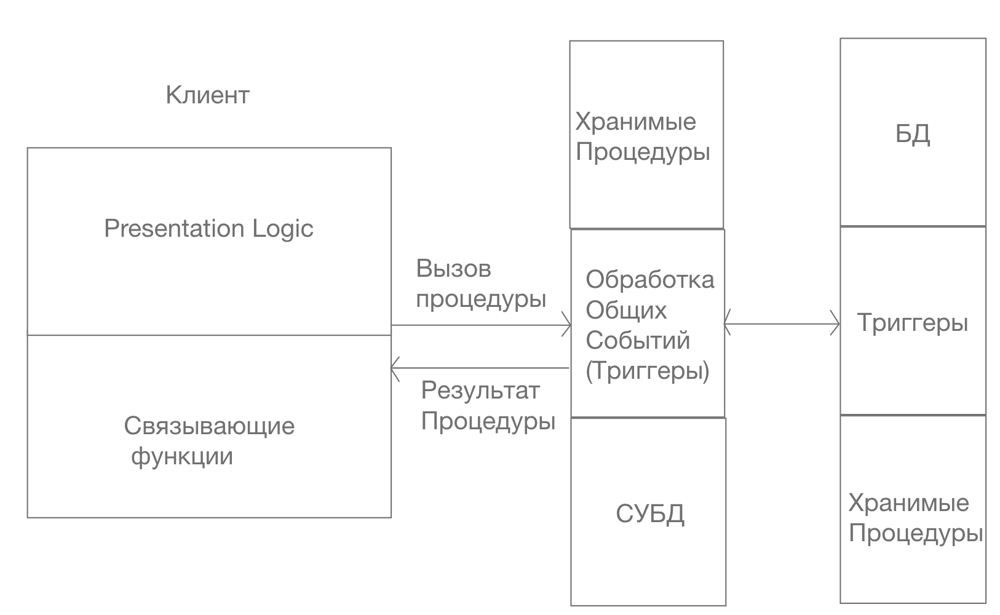

В этой модели бизнес логика разделена между клиентом и сервером. На сервере бизнес логика реализованная в виде хранимых процедур, то есть специальных программных модулей, которые хранятся в БД и управляются непосредственно СУБД. Клиентское приложение обращается к серверу с командой запуска хранимой процедуры, а сервер выполняет эту процедуру и регистрирует все изменения в БД, которые в ней предусмотрены. Сервер возвращает клиенту данные,  релевантные его запросу, которые требуются клиенту либо для вывода на экран, либо для выполнения части бизнес логики, которая расположена на клиенте. Трафик обмена информации резко уменьшается.

- - - -

Централизованный контроль в модели сервера БД, выполняется с использованиям механизма триггеров. Триггеры также являются частью БД. Термин триггер взят их электроники и семантически очень точно характеризует механизм отслеживания специальных событий которые связанны с состоянием БД.

**Триггер в БД** - является некоторым тумблером который срабатывает при возникновении определенного события в БД. Ядро СУБД проводит мониторинг всех событий которые вызывают созданные и описанные триггеры в БД и при возникновении соответствующего события СУБД запускает соответствующий ей триггер. Каждый триггер представляет собой некоторую программу, которая выполняет какие либо действия с БД. Они могут вызывать хранимые процедуры.

Механизм использования триггеров предполагает  что при срабатывании одного триггера могут возникнуть события которые вызовут срабатывания других триггеров. Этот инструмент требует аккуратного применения чтобы не получился цикл бесконечного срабатывания триггеров.

В данной модели сервер является активным потому что не только клиент но и сам сервер используя механизм триггеров может быть инициатором обработки данных в базе данных.

И хранимые процедуры и триггеры хранятся в словаре БД, что существенно уменьшает дублирование алгоритмов обработки данных в разных клиентских приложениях. Для написания хранимых процедур и триггеров используются расширения стандартного языка SQL, характерные для каждого конкретного вендора.

**Недостатком данной** модели является большая загрузка сервера. 

Сервер обслуживает множество клиентов и выполняет следующие функции:
1. Осуществляет мониторинг событий связанных с описанными триггерами.
2. Обеспечивает автоматические срабатывание триггеров при возникновении связанных с ними событий.
3. Обеспечивает исполнение внутренней программы каждого триггера
4. Запускает хранимые процедуры по запросам пользователей
5. Запускает хранимые процедуры из триггеров
6. Возвращает требуемые данные клиенту
7. Обеспечивает все функции СУБД: доступ к данным, контроль и поддержку целостности данных, контроль доступа, обеспечение корректной параллельной работы всех пользователей с БД.

Если мы переложили на сервер большую часть бизнес логики приложений, то требования к клиентам в этой модели резко уменьшаются. Иногда такую модель называют - «Модель с тонким клиентом». В отличие от предыдущих моделей где на клиента возлагались гораздо более серьезные задачи. Такие модели называются «Модель с толстым клиентом».

## Архитектура сервера приложений

Для разгрузки сервера БД была предложена 3-х уравнивая модель. Эта модель является расширением 2-х уровненной модели и в ней вводится дополнительный промежуточный уровень между клиентом и сервером. Архитектура 3-х уровневой модели имеет промежуточный уровень который содержит один или несколько серверов приложений. 

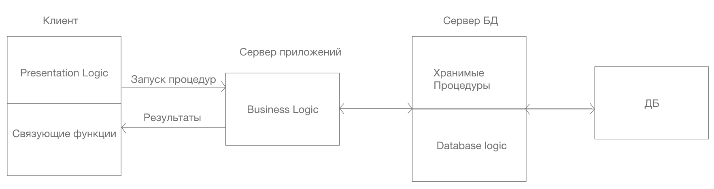

В этой модели компоненты приложения делятся между 3-мя исполнителями: клиент обеспечивает логику представления данных включая графический пользовательский интерфейс и локальные редакторы. Клиент может запускать локальный код приложения клиента, который может содержать обращения к локальной БД расположенной на компьютере клиента.

Клиент исполняет коммуникационные функции Front-end части приложения, которые обеспечивают доступ клиенту в локальную или глобальную сеть. Дополнительная реализация взаимодействия между клиентом и сервером может включать в себя управление распределенными транзакциями, что соответсвует тем случаям когда клиент также является клиентом менеджера распределенных транзакций.

Сервер приложений составляет новый промежуточный уровень архитектуры, он спроектирован для исполнения общих бизнес функций клиентов. Серверы приложений поддерживают не только функции клиентов как части рабочих групп, но и сетевую доменную операционную среду, хранят и исполняют общие правила бизнес логики поддерживают каталоги с данными, обеспечивают обмен сообщениями и поддержку запросов к БД особенно в распределенных транзакциях. Это все функции back-end.

Серверы БД в этой модели занимаются исключительно функциями СУБД (обеспечивают функции создания и ведения БД, поддерживают целостность реляционной БД, обеспечивает функции хранилища данных warehouse service). Кроме того на них возлагаются функции создания резервных копий БД и восстановления БД после сбоев, а также управление выполнением транзакций  и поддержка устаревших приложений (Legacy app). 

Эта модель обладает большей гибкостью чем двух уравнивая модель. Больше всего заметны преимущества модели с сервером приложений в тех случаях когда клиенты выполняют сложные аналитические расчеты над БД, которые относятся к области OLAP приложений. O - on L - line A - analitical P - processing (аналитика в реальном времени).  В этой моделе большая часть бизнеса логики клиента изолированна от возможности встроенного SQL (реализованного в конкретной СУБД). И может быть выполнена на стандартных языках программирования C++, C#, PHP, Basic and more.

Это повышает переносимость системы и ее масштабируемость. Функции промежуточных серверов могут быть в этой модели распределены путем поддержки XA протокола, который поддерживается большинством СУБД. 

**XA протокол** - протокол поддержки глобальных транзакций.

Закончили первую часть. Контрольная
- - - -

## Управление БД с помощью SQL

В основе реляционной модели лежит математическое понятие «теоретика множественного отношения». Это отношение представляет собой декартово произведение доменов. 

**Доменом** - называется набор значений элементов данных одного типа, отвечающих поставленным условиям.

Например: Домен - ФИО определяется на базовом типе строк символов, но в число его значений могут входить только те строки, которые могут означать имя.

Язык SQL представляет собой всемирный стандарт на средство работы с данными. Наличие такого стандарта обеспечивает унификацию ПО и его независимость от сервера данных и аппаратной платформы. Язык SQL является не процедурным языком, с помощью его программист определяет только требуемый результат, не указывая алгоритм его достижения.

SQL используется при формировании запросов к реляционным БД, обновление БД, управление БД.

С помощью команды SQL  можно: 
1. Создавать БД и таблицы в них 
2. Создавать представления, функции, хранимые процедуры и триггеры
3. Редактировать, добавлять и удалять записи в таблице
4. Восстанавливать потерянные данные
5. Управлять пользователями и группами пользователей
6. Управлять доступом к объектам БД для пользователей и групп пользователей
7. Осуществлять выборку данных из БД и многое другое

### Синтаксис SQL (SELECT)

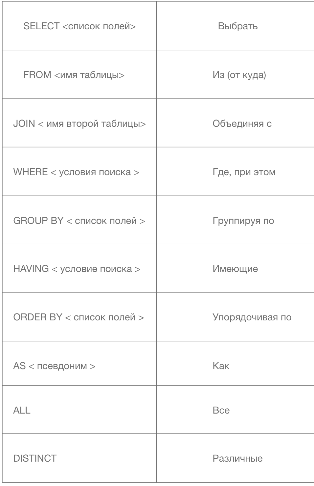


Пример: 
` SELECT Фирма FROM Клиенты WHERE Город = 'Москва' `
 В данном примере будут выбраны все фирмы из таблицы «Клиенты» у которых город «Москва». **Только латиница**

1. SELECT  является первым ключевым словом в определении SQL запроса. 
2. При указании более чем одного поля в предложении SELECT их имена отделяются друг от друга запятыми. Перечислять имена полей следует в той последовательности в которой они должны быть представлены на экране.
3. Если используются имя поля содержащие пробелы или другие разделители его следует заключать в квадратные скобки. Например [Город клиента]
4. Если в запросе осуществляется выборка из нескольких таблиц, имеющих одинаковые поля, то во избежании не определенности в списках полей необходимо использовать полную спецификацию. <имя таблицы>.<имя поля таблицы>
5. Если имена таблиц или имена полей имеют длинные названия, то вместо них можно использовать псевдонимы, заданные с помощью `AS`

### Директива FROM

FROM - задает имена таблиц или запросов, которые содержат поля перечисленные в операторе SELECT. 

1. Директива FROM является обязательной.
2. При перечислении таблиц, маленькие таблицы, содержащие меньшее количество записей, рекомендуется указывать первыми

Пример: `SELECT * FROM Clients`

С помощью звездочки из таблицы можно выбрать все поля, звездочкой нужно пользоваться очень аккуратно, в программировании рекомендуется избегать этого оператора, лучше указывать список тех полей которые нужны.

### Директива  WHERE

Является не обязательной директивой, в WHERE задается условие поиска, несколько условий поиска отделяется между собой логическими операторами **AND** или **OR**. 

Обратное значение условия задается с помощью оператора логического отрецания NOT. В предложениях WHERE могут быть записаны 5 видов условий:
1. Сравнение >, <, =, <=, >=, <>
2. Шаблон (Соответствие шаблону) оператор `<поле> LIKE <шаблон>`, в шаблоне _ - любой символ, % - любое количество любых символов, [] - в этом месте могут быть символы перечисленные в нутри, [^] - диапазон символов которые не должны быть на этом месте.
3. Диапазон значений BETWEEN <значение> AND <значение> включительно.
4. Принадлежность множеству, оператор <поле> IN <множество>
5. Значение NULL, оператор IS, <поле> IS NULL или <поле> IS NOT NULL.

### Директива ORDER BY

Определяет список полей и порядок сортировки записей включенных в выборку. 

` ORDER BY <поле 1> [ASK, DESC], ... < поле N>`

**ASK** - задает сортировку по возрастанию 
**DESC** - задает сортировку по убыванию

Значение по умолчанию является ASK, его можно явно не указывать.

Директива не является обязательной, если она не используется данные будут представлены в не сортированном виде.

Порядок перечисления полей в ORDER BY задает иерархию уровней сортировки.

**Директива ORDER BY всегда записывается последней в запросе**.

### Директива GROUP BY

Группирует записи данных  и объединяет в одну запись все записи данных, которые содержат идентичные значения в указанном поле или полях. С GROUP BY часто используются агрегатные функции:
1. SUM - суммирует все значения указанные в выражении SUM( <выражение> )
2. COUNT - подсчет количества строк COUNT( <выражение> ), для подсчета всего всех строк COUNT(*)
3. MIN - определяет минимальное значение из указанного значения, MIN ( <выражение>)
4. MAX- максемальное значение 
5. AVG - среднее значение из указанного выражения AVG( <выражение> )
Пример:

```
SELECT Product.name, SUM(Product.cost)
FROM Product 
GROUP BY Product.name
```

В этом примере все записи из таблицы Product с одинаковыми названиями товара будут объединены в группы, для каждой группы будет выведено на экран одна запись с названием товара и суммарной стоимостью товаров этой группы

Директива не является обязательной. Для фильтрации записей в запросе с GROUP BY может использоваться директива WHERE, а для фильтрации групп директива HAVING. 

В директиве GROUP BY можно использовать любые поля таблиц упомянутые во FROM. Эти поля не обязательно должны быть перечислены в SELECT

В операторе SELECT для всех полей, не перечисленных в директиве GROUP BY, должна присутствовать одна из агрегатных функций

### Директива HAVING

Используется для фильтрации записей после группировки то есть только в том случае, если в запросе есть GROUP BY

Директива HAVING не является обязательной 

В случае если она необходима в запросе, то записывается следом за директивой GROUP BY

Функция директивы HAVING схожа с WHERE - обе используются для фильтрации, но директива WHERE определяет какие записи должны участвовать в группировке то есть фильтруют записи до группирования, а HAVING определяет какие из получившихся групп будут включены в результаты запроса, то есть фильтрует записи после группировки.

::Вывести факультеты в которых количество учащихся больше 200 человек::

```
SELECT Название Факультета, COUNT(номер зачетки)
FROM Студент
WHERE Дата окончания обучения > now() // now - in Oracle
GROUP BY Название Факультета
HAVING COUNT(номер зачетки) > 200 
```

### Предикаты All and DISTINCT

Записываются в SELECT перед списком полей вывода. 

ALL - означает вывод всех значений включая дубликаты, значение по умолчанию, в запросе может быть опущено.

DISTINCT - используется в тех случаях когда нужно удалить дубликаты записей и включить в выборку только уникальные значения выбираемых полей.

DISTINCT сильно замедляет работу SQL запросов, применять стоит с осторожностью

```
SELECT [ALL | DISTINCT] <list of attributes> FROM <table name>
```

## Операция соединения таблиц (JOIN)
С помощью оператора JOIN формируется связь эквивалентности,  в объединении при таком типе связи включаются данные из двух таблиц, если в поле связи имеющимся в обеих таблицах найдены совпадающие значения. 

INNER JOIN - эквивалентна JOIN так как INNER - значение по умолчанию

LEFT JOIN - в случае применения в обьединение включается все записи из левой таблицы, а из правой только те, которые имеют совпадающие значения в поле связи.

RIGHT JOIN - в обьединение включаются все записи из правой таблицы, а из левой только те, которые имеют совпадающие значения в полях связи.

Операция объединения JOIN является частью директивы FROM 
```
SELECT *
FROM table_1 [INNER|LEFT|RIGHT] JOIN table_2
 ON table_1.name = table_2.name [AND OR ...] [<условие>]
```

```
  ТОВАР
    Tov_id | name
     1     | молоко
     2     | хлеб      
     3     | рыба
     4     | мясо

  СДЕЛКА
  Ord_id | To_id |   Date   | Count | Ten_id
     1       1      10.10.18     1       1
     2       1      11.11.18     1       2 
     3       3       1.10.18     1       3
     4       3       2.10.18     1       4

  Обьединенная таблица INNER JOIN
  Tov_id |   Name  | Tov_id | Ord_Id |  Date  | Count | Ten_Id
      1      молоко   1        1      10.10.18   1        1
      1      молоко   1        2      11.11.18   1        2
      3      масло    3        3       1.10.18   1        3
      3      масло    3        4       2.10.18   1        4
```


```
  Обьединенная таблица LEFT JOIN
  Tov_id |   Name  | Tov_id | Ord_Id |  Date  | Count | Ten_Id
      1      молоко   1        1      10.10.18   1        1
      1      молоко   1        2      11.11.18   1        2
      3      масло    3        3       1.10.18   1        3
      3      масло    3        4       2.10.18   1        4
      5      мясо     null    null     null      null   null
      4      рыба     null    null     null      null   null
      2      хлеб     null    null     null      null   null

```


```
  Обьединенная таблица RIGHT JOIN
  Tov_id |   Name  | Tov_id | Ord_Id |  Date  | Count | Ten_Id
      1      молоко   1        1      10.10.18   1        1
      1      молоко   1        2      11.11.18   1        2
      3      масло    3        3       1.10.18   1        3
      3      масло    3        4       2.10.18   1        4
      null   nulll    6        6       null      null    null

```


::ДЗ Составить ER-диаграмму по составленной задачи::

Электронные экзамены

::ДЗ Оформить отчет по проделанной работе::
Описать CREATE DATABASE  ФИО 

CREATE TABLE студенты, с полями id, number of book, first name, last name, middle name, birthay_year, address, telephone, photo

ALTER TABLE установили id как PRIMARY_KEY

INSERT_INTO запись

Оформить ответ, SQL запрос, и скриншот
- - - -
## Представление
Виртульланая таблица содержимое которой определяется входящем в него SQL-запросом, в отличии от обычных таблиц представления не хранят данные. 

## Триггеры
```
CREATE TRIGGER <имя триггера> BEFORE | ALTER <событие>
ON <имя таблицы>
[REFERENCING <список_старых_или_новых_впевдонимов>]// OLD|NEW
[FOR EACH { ROW | STATEMENT}]
[WHEN {условие триггера}]
<тело_триггера>
```

INSERT, UPDATE, DELETE - триггерное событие

::Создать 3 триггера, один на INSER, UPDATE, DELETE. Можно на несколько таблиц. Хранить в логе имя пользователя и дату изменения либо вставки::

- - - -

## Пользователи БД. Роли. Привелегии
Создать пользователя
```
CREATE USER <user_name>
```

Добавить привелегии
```
GRANT <привелегия> [,..n] | ALL PRIVILEGES
ON <имя_таблицы>
TO <идентификатор пользователя> [,...n] | PUBLIC
[WITH GRANT OPTION]
```

Привелегии бывают: SELECT | DELETE | INSERT | UPDATE | REFERENCES | INDEX | CREATE | ALTER | DROP

Забрать привелегии
```
REVOKE [ GRANT OPTION FOR] <привлегия>[,...n] | ALL PRIVILEGES
ON имя_обьекта
FROM <идентификатор_пользователя>[,..n] | PUBLIC
[ RESTRICT | CASCADE ]
```


::Создать пользователя, добавить ему роль SELECT INSERT UPDATE DELETE, подключаемся за него, делаем INSERT в таблицу, результат в отчет, делаем CREATE TABLE получило или не получилось, даем привелегии пользователю на CREATE и заново переподключаемся к базе данных, создаем таблицу, результат в отчет, потом удаляем все роли и потом самого пользователя.::


#Гипич